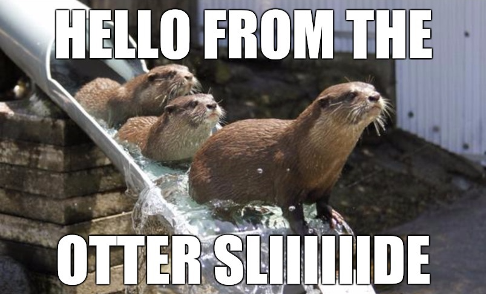

Lead developer focused on building complex software systems and AI-driven
workflows.

I work primarily as a full-stack engineer and also handle DevOps when needed.
Earlier in my career I built both mobile and web applications across different
companies, which gave me a strong product-oriented mindset.

Today I mostly design and implement complex AI workflows and automation systems
for large organizations, with a strong focus on reliability, scalability and
real business impact.

Tech-wise, I mainly work with Go for production systems. I also use Python or
TypeScript for AI, automation and rapid prototyping, with critical components
often rewritten in Go, Zig or Rust afterward. For applications, I have
experience with Flutter, SolidJS, Svelte and modern web stacks.

I enjoy exploring new technologies and building things beyond pure engineering,
especially around music, creative coding and design 🎹

Most of my repositories are private, but feel free to explore the public ones —
you might find something interesting 👀
